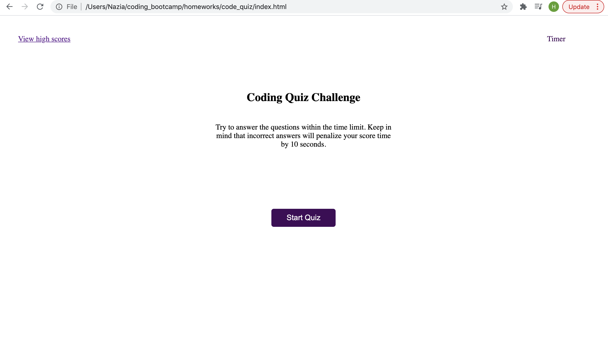
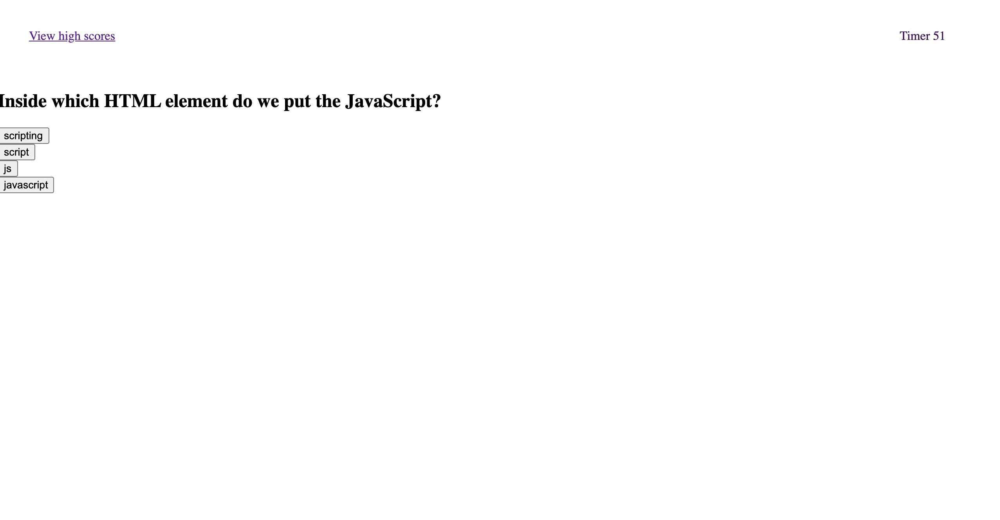
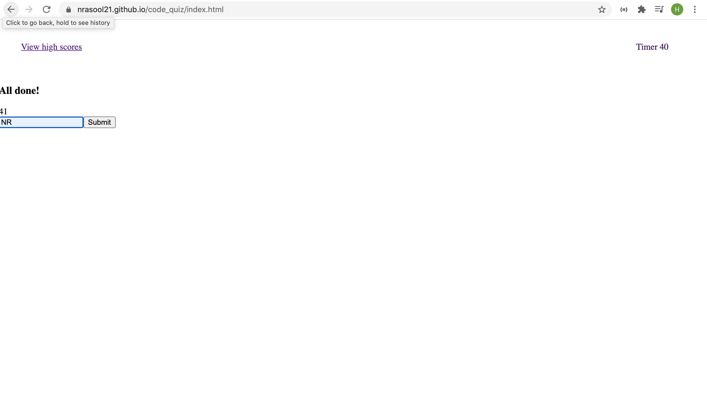
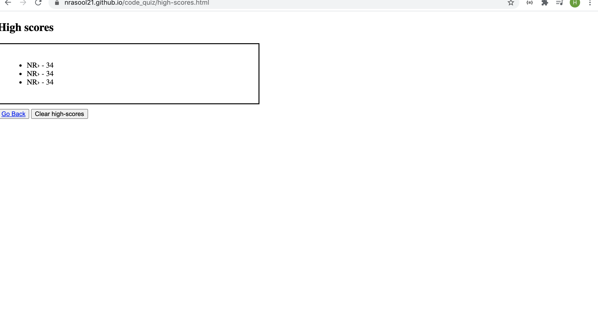

# Code Quiz

## Description

We were asked to build a timed coding quiz with multiple-choice questions. This app will run in the browser and will feature dynamically updated HTML and CSS powered by JavaScript code that we were to write.
The app should have a clean, polished, and responsive user interface.

## What We Did

- Created game logic framework for JavaScript.
- On the main page added a link 'to view high score' page and a functioning timer.
- Created a start quiz button which dynamically updated the html page, removing the start button and presenting a series of questions.
- Declared all the questions as an object in an array.
- Created function for the timer such that if a question is answered incorrectly, it must subtract time from the timer as part of the game logic.
- Further added logic to the timer function upon reaching zero, the game must end.
- Declared the outcome of the quiz in scores which is same as the seconds left on the timer.
- When the game is over the page dynamically renders another page where the score is displayed with a form. to fill details such as user initials and submit.
- Used preventDefault method for form.
- On click of the submit button, high-scores page is rendered.

## Screenshots

## Link To Deployed Application

https://nrasool21.github.io/code_quiz/
